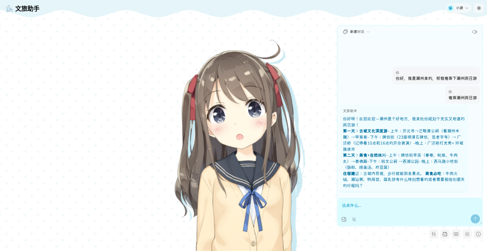
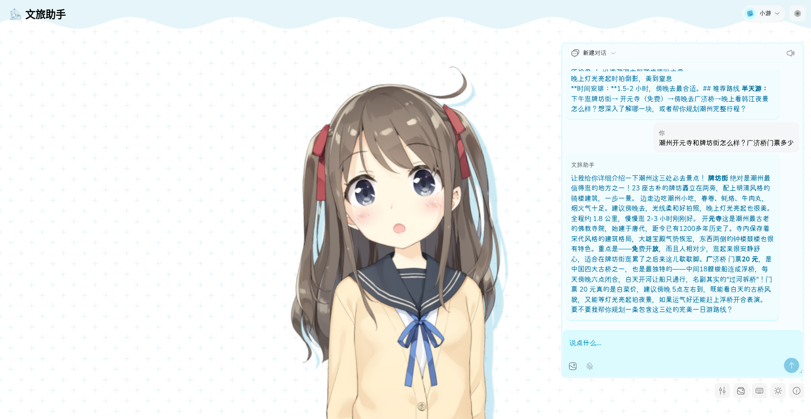
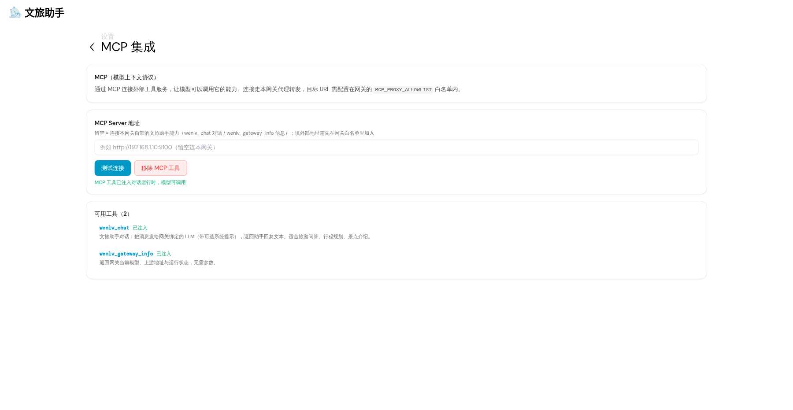
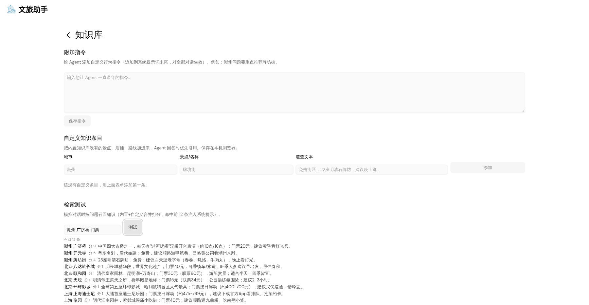
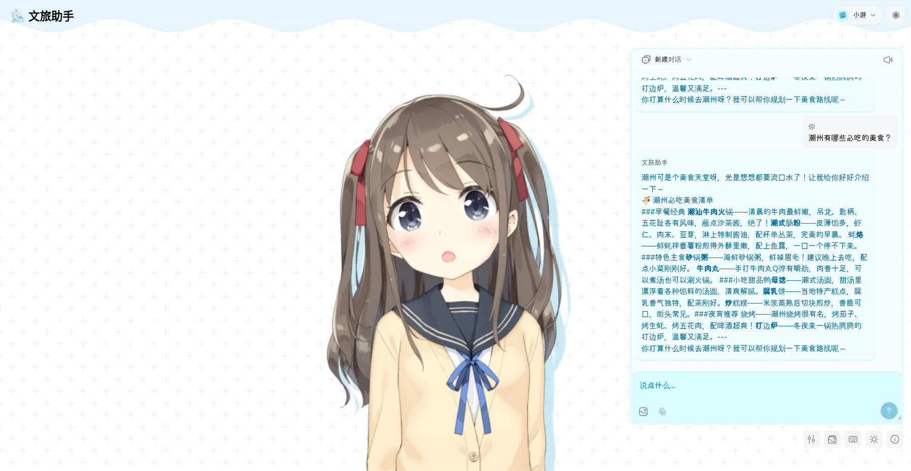
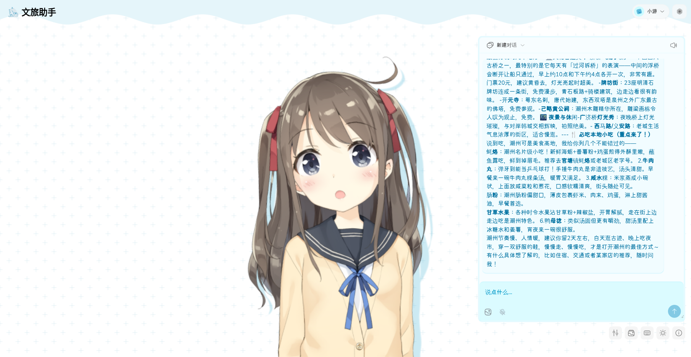
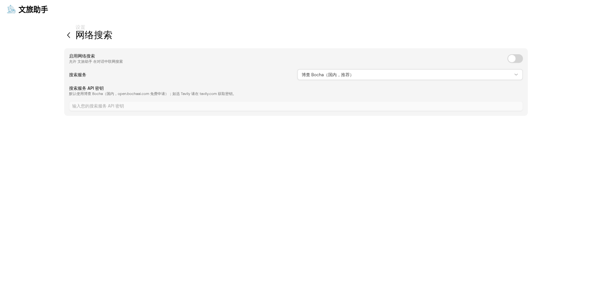
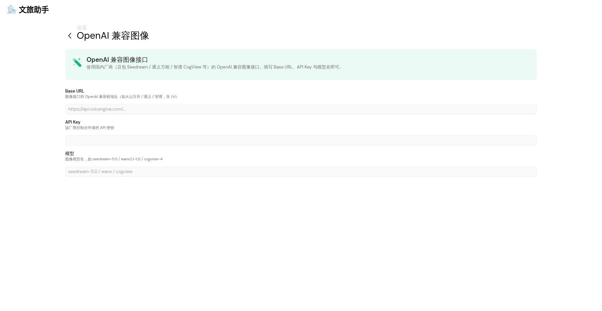

# 小游 XiaoYou · AI 文旅导游

> **懂中国的 AI 文旅导游** —— 景点讲解 · 行程规划 · 美食推荐 · 实用贴士
>
> 自托管 · 国内可用 · 高度可自定义 · 数字人形象陪伴

「小游」是一款面向国内用户的 AI 文旅助手：像一位当地朋友一样陪你逛古城、吃地道、看文化。它跑在你的**浏览器 + 你自己的 Linux 服务器**上——数据、Key、人设全部由你掌控。

本项目为**深度国产化、品牌化重造**的文旅数字人 Agent：大幅裁剪海外/无关能力，落地 2026 主流 Agent / 数字人 / 开源框架的 6 项能力。许可说明见文末。

---

## ✨ 特性一览

| 能力 | 说明 |
| --- | --- |
| 🗣️ **数字人对话** | 文字 + 语音双通道；Live2D/VRM 虚拟形象；**口型随音量 RMS 自动开合**，**表情随情绪标签自动切换** |
| 🧠 **智能文旅大脑** | 内置 100+ 条全国城市/景点速查库；**RAG 检索**（按你的提问召回相关知识注入）；附加指令自由定制 |
| 🧭 **行程规划** | 问天数/预算/同行人/出发地后给方案；门票、开放时间等动态信息一律提示「以官方为准」，**不编造** |
| 🗺️ **目的地知识库** | 城市/景点/美食覆盖；可**增删改查自定义条目**；支持检索测试视图验证召回 |
| 💾 **长期记忆** | 对话自动沉淀（城市+景点双命中才沉淀）；**来源标记 auto/manual**、总量硬上限、一键清空沉淀、可编辑删除 |
| 🔌 **MCP 互操作** | 网关内置 **MCP 服务端**（`/mcp`，对话/网关信息工具）；前端 **MCP 客户端**（连接任意 MCP Server，把工具注入对话） |
| 🔎 **联网搜索** | 内置**博查 Bocha（国内源）**/ Tavily 双源可选，结果以不可信内容包裹注入 |
| 🎨 **图像创作** | ComfyUI（本地）+ **OpenAI 兼容图像（国内：豆包 Seedream / 通义万相 / 智谱 CogView）**，对话中按场景自动触发生成 |
| 🖥️ **自托管网关** | Linux 后台 + Web 前端；LLM Key 只存服务器端；`/health` 健康检查、上游模型列表透传、请求日志 |
| 🎨 **高度自定义** | 角色卡（人设/性格/场景/系统提示）、界面文案、知识库、记忆开关、提供商模型全部可调 |

## 📸 界面预览

| 数字人对话（潮州行程） | 长期记忆沉淀 | MCP 工具注入 | RAG 知识检索 |
| --- | --- | --- | --- |
|  |  |  |  |

| 角色立绘兜底 | 知识库自定义 | 联网搜索（博查国内源） | 图像创作（国内接口） |
| --- | --- | --- | --- |
|  |  |  |  |

## 🏗️ 架构

```
浏览器（Web 前端）
   │  文字 / 语音 / Live2D 形象 / 本地记忆(DuckDB WASM)
   ▼
Linux 服务器（小游网关 :8080）
   ├── 静态托管  apps/stage-web/dist
   ├── LLM 代理  /v1/chat/completions（流式转发，Key 只在服务器端）
   ├── MCP 服务端  /mcp            （JSON-RPC，对话/网关信息工具）
   ├── MCP 代理   /mcp/proxy       （白名单转发，规避 CORS）
   ├── 健康检查   /health
   └── 回复清洗   身份防泄露（防上游模型自曝底层人设）
   ▼
任意 OpenAI 兼容上游：DeepSeek / 火山方舟 / 智谱 / Kimi / 云知声 / AgnesAI / Ollama(本地) …
```

## 🚀 快速开始

### 1. 构建前端

```bash
pnpm install --ignore-scripts
pnpm build:web        # 生产构建，产物在 apps/stage-web/dist
```

### 2. 启动网关（Linux 后台）

```bash
cd airi-tour
cp server/.env.example server/.env
# 编辑 server/.env：
#   LLM_API_KEY=你的上游Key（必填）
#   LLM_MODEL=你的模型名        # 如 deepseek-chat / u2-flash / agnes-2.5-flash
#   LLM_BASE_URL=上游兼容地址     # 默认 https://api.deepseek.com/v1
./server/start.sh
```

网关也支持 Docker：`cd server && docker compose up -d --build`。

### 3. 浏览器接入

访问 `http://<服务器IP>:8080` → 首次引导选 **OpenAI 兼容 API**：

| 配置项 | 填写 |
| --- | --- |
| Base URL | `http://<服务器IP>:8080/v1` |
| API Key | 服务器 `.env` 的 `GATEWAY_KEY`（未设置可填任意非空值） |
| 模型 | 引导校验会自动探测可用模型；也可手动选 |

## ⚙️ 网关环境变量

| 变量 | 默认值 | 说明 |
| --- | --- | --- |
| `PORT` | 8080 | 监听端口 |
| `HOST` | 0.0.0.0 | 监听地址 |
| `LLM_BASE_URL` | `https://api.deepseek.com/v1` | 上游 OpenAI 兼容根地址（可换豆包/通义/云知声等） |
| `LLM_API_KEY` | （必填） | 上游 LLM Key，只存服务器端 |
| `LLM_MODEL` | `deepseek-chat` | 默认模型名（网关 `/v1/models` 会透传上游真实列表） |
| `GATEWAY_KEY` | 空 | 可选。设置后前端必须填相同值才能访问网关 |
| `MCP_PROXY_ALLOWLIST` | 空 | MCP 代理白名单（逗号分隔 URL），仅转发白名单目标 |

## 🧩 核心能力说明

### 文旅知识库（`packages/stage-ui/src/constants/tour/tour-knowledge.ts`）

- 内置速查数据注入系统提示；`searchTourKnowledge` 打分召回（城市/景点整体命中 +10、分词 +4、摘要 +1，同名同城自定义优先）；
- 知识库页可增删改查自定义条目、检索测试、一键查看召回视图。

### 记忆体系

- **自动沉淀**：回复后按「城市+景点」双命中抽取，写入长期记忆（`source: auto`）；
- **硬上限**：`MAX_USER_KNOWLEDGE_ITEMS = 100`，超出保留最新；
- **管理页**：来源标签、统计、一键清空沉淀（保留手动条目）、逐条编辑删除。

### MCP

- 网关服务端：`POST /mcp`（initialize / tools/list / tools/call，暴露 `wenlv_chat`、`wenlv_gateway_info`，需 Gateway Key）；
- 前端客户端：设置页配置任意 MCP Server URL → 测试连接 → 工具列表 → 注入对话（内置 `builtIn_mcpListTools` / `builtIn_mcpCallTool`）。

### 数字人

- **口型**：`model-driver-lipsync` + Web Audio RMS（阈值 0.08）驱动 `mouthOpen`；
- **表情**：`emotionsQueue` → Live2D motion / Tachie `setEmotion` / VRM expression；
- **兜底**：Live2D 渲染失败自动降级为静态立绘。

### 回复清洗（身份防泄露）

部分上游模型内置固定自我介绍（如云知声 u2-flash 会自曝「我是U2.1，由云知声研发…」）。网关透传层与前端展示层**双重清洗**：将其改写为「我是文旅助手小游，你的 AI 文旅导游」，保证人设统一。

## 📁 目录结构

```
apps/stage-web/               # Web 应用（Vue3 + Vite + PWA，构建产物 dist/）
packages/
  stage-ui/                   # UI 与状态：角色卡、聊天、设置、知识库、记忆、MCP
  provider-inference/         # LLM 提供商适配（国内直连 + OpenAI 兼容 + Ollama）
  pipelines-audio/            # 语音流水线（STT/TTS/说话检测）
  stage-ui-live2d/            # Live2D 形象渲染
  i18n/                       # 多语言文案（中文本地化）
server/
  src/index.ts                # 小游网关（静态托管 + LLM 代理 + MCP + 健康检查 + 清洗）
  dev/mock-llm.mjs            # 网关自测用 mock 上游（无需真实 Key）
  Dockerfile / docker-compose.yml / start.sh / .env.example
```

## ❓ 常见问题

- **浏览器直连模型 API 被 CORS 拦截？** 用「Linux 网关」模式（同源代理）即无此限制。
- **数据存哪？** Web 直连时全部在浏览器本地（localStorage / IndexedDB / DuckDB WASM）；网关模式下 LLM Key 在服务器端。
- **想无 Key 自测网关？** `node server/dev/mock-llm.mjs`，网关设 `LLM_BASE_URL=http://localhost:9001/v1`、`LLM_API_KEY=mock-key`。
- **换个模型提供商？** 改 `.env` 的 `LLM_BASE_URL / LLM_API_KEY / LLM_MODEL`，重启网关；前端引导校验会自动探测可用模型。

## 🛣️ 路线图

- [x] 国内化改造（裁剪海外/提供商预设/界面中文化）
- [x] 文旅知识库 + RAG 检索 + 自定义条目
- [x] 长期记忆自动沉淀 + 管理页
- [x] MCP 服务端/客户端双端
- [x] 数字人（口型 RMS / 表情 / 立绘兜底）
- [x] 自托管网关生态（健康检查/模型透传/日志/清洗）
- [ ] 桌面版（Electron，打包 Windows/macOS）
- [ ] 实时能力接入（天气/高德地图 API）
- [ ] 向量化检索升级（本地 embedding）

## 📄 开源许可

MIT License。本项目为 [Project AIRI](https://github.com/moeru-ai/airi) 的衍生作品（Copyright (c) 2024-PRESENT Neko Ayaka），第三方组件许可详见 [`THIRD_PARTY_NOTICES.md`](THIRD_PARTY_NOTICES.md)。**商业发布前请逐项核对第三方许可（尤其 Live2D Cubism SDK 出版授权）。**
